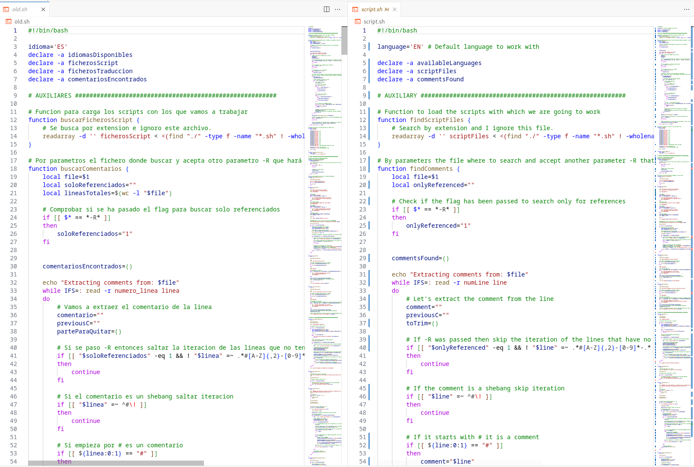
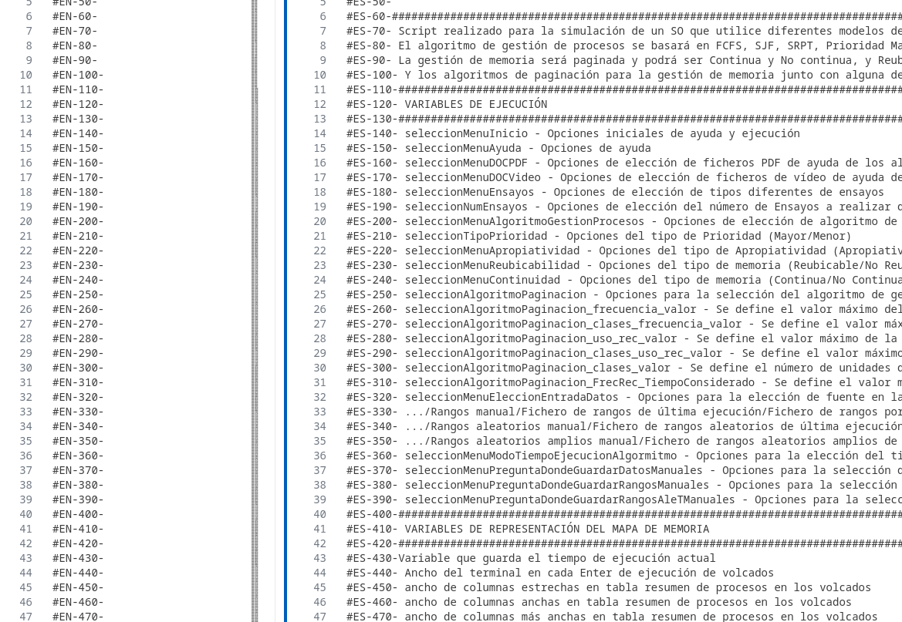

*¿Qué pasa? Estoy aprendiendo, ¿¡Vale!?*
*¡Ver los problemas existentes abajo!*

# Bash Comment Translate Tool (*¡Funciona!* con bugs D: )

Bienvenido a mi infierno personal. Ahora también atrapamos los echos.

El script referencia todos los comentarios y echos, y te genera ficheros de traducción con las referencias creadas para poder intercambiarlos facilmente.

## Problemas existentes y pendientes

1. *En memoria* Por ahora solo createReferences. actualizar el add renumerate, etc...
2. *Renumerado BUG* Funciona correctamente, pero las referencias de los echoes no empiezan en 10 sino en otro numero. Esto es debido a los echoes multilinea y que reenumero de atrás hacia adelante. En la funcion de reenumerado se explica más. (NO ES UN BUG ES UN FEATURE ;D)
3. Eliminar el sed del findEchoes
4. Borrar variables no usadas
5. Refactor ligero
6. Comentar bien
7. Comentar traducido
